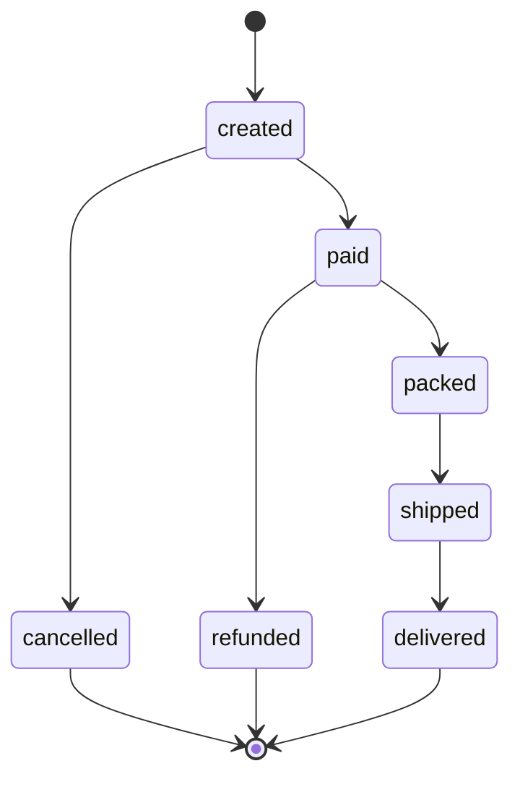

# Order Fulfillment Tracking System

A backend system for order lifecycle management and concurrent processing, standardly designed for e-commerce business needs.

## Business Problem & Project Purpose
This project is built to solve a critical real-world pain point: **an e-commerce company losing track of customer orders between the warehouse shelves and the customer's front door**. 

Without a rigorous tracking mechanism, operational visibility drops, and illegal or illogical order states can occur (e.g., an order being refunded before it is even paid for).

To overcome these challenges, this system provides a robust solution that:
* **Enforces Strict State Transitions:** Governs the entire order lifecycle through a secure State Machine, preventing out-of-order status jumps.
* **Handles High-Volume Concurrent Ingestion:** Efficiently processes thousands of simultaneous tracking event updates streaming in from delivery drivers on the road using optimized Go Worker Pools.
* **Drives Operational Insights:** Aggregates messy, high-frequency time-series event data into clean, actionable daily operational reports for management teams.
---

## Table of Contents
- [1. Tech Stack](#1-tech-stack)
- [2. Core Features](#2-core-features)
- [3. Architecture & Structure](#3-architecture--structure)
  - [Layered Architecture](#layered-architecture)
  - [Order State Machine](#order-state-machine)
- [4. API Reference](#4-api-reference)
  - [Authentication](#authentication)
  - [Key API Endpoints](#key-api-endpoints)
- [5. Concurrency & Reporting](#5-concurrency--reporting)
- [6. Getting Started (Local Setup)](#6-getting-started-local-setup)
- [7. Testing Strategy](#7-testing-strategy)
- [8. Scope & Assumptions](#8-scope--assumptions)

---

## 1. Tech Stack

| Component | Technology |
|---|---|
| **Language** | Go 1.26.2 |
| **Framework** | GoFiber v3 |
| **Database** | PostgreSQL 16 + GORM |
| **Security** | API Key (Stateless) |
| **Deployment** | Docker Compose |

---

## 2. Core Features

- **Order Management:** Create, view, and safely transition order statuses.
- **Concurrent Batch Processing:** Ingest thousands of tracking updates simultaneously using Go Worker Pools without race conditions.
- **Automated ETL Reporting:** Extract historical event data and transform it into aggregated daily business reports.
- **Role-Based Access:** Isolated logic and permissions for Delivery Drivers and Admins.

---

## 3. Architecture & Structure

### Clean Architecture Structure
The system strictly follows Clean Architecture principles, organized into 5 decoupled layers connected via interfaces:

- **Router & Middleware Layer (`routers/`, `middlewares/`):** The outermost layer handling HTTP routing and request interception (e.g., API Key Auth, Authorization).
- **Handler/Delivery Layer (`handlers/`, `dto/`):** Parses incoming HTTP requests, validates input payloads using DTOs, and formats the standard HTTP responses.
- **Service/Use Case Layer (`services/`):** The orchestrator of the system. Contains pure business logic, Concurrency handling (Worker Pools), and delegates tasks to repositories.
- **Domain/Model Layer (`models/`):** The absolute core of the application. Contains enterprise business rules, database entity structures (GORM models), and strict State Machine transition rules.
- **Repository/Data Access Layer (`repositories/`):** An abstracted data layer responsible for direct database interactions, query execution (via ORM or Raw SQL), and Transaction handling.

### Core Entities
The system uses three primary tables:
- `orders`: Stores the current state and customer details (using `JSONB` for flexibility).
- `order_events`: An immutable time-series ledger tracking every single state transition.
- `reports`: Stores aggregated daily metrics (Total orders, income, avg delivery time).

### Order State Machine

*(Note: `cancelled`, `refunded`, `delivered` are terminal states).*

### Project Structure
```text
.
├── cmd/                           # Application entry points
│   ├── api/                       # API server
│   └── migrate/                   # Database migration tool
├── configs/                       # Configuration files
├── db/                            # Database migrations and seed data
├── docs/                          # API documentation and Swagger specs
├── internal/                      # Core application logic (unexported)
│   ├── dto/                       # Data Transfer Objects
│   ├── handlers/                  # HTTP request handlers
│   ├── middlewares/               # HTTP middleware (auth, logging, etc.)
│   ├── models/                    # Database models and enums
│   ├── repositories/              # Data access layer
│   ├── routers/                   # API route definitions
│   ├── services/                  # Business logic and orchestration
│   └── tests/                     # Unit and integration tests
├── pkg/                           # Shared packages
│   └── postgresql/                # PostgreSQL utilities
├── docker-compose.yml             # Container orchestration
├── .env.example                   # Environment template
├── Makefile                       # Build and development commands
└── README.md                      # This file
```

---

## 4. API Reference

### Authentication
The API uses **stateless API Key** authentication with two distinct documented roles:
- **Driver:** Uses `DRIVER_API_KEY` (Can view orders and update tracking status).
- **Admin:** Uses `ADMIN_API_KEY` (Full access, batch imports, and reporting).

*Example Request:*
```bash
curl -H "X-API-Key: your_configured_key_here" http://localhost:5000/api/v1/orders
```

### Key API Endpoints
| Method | Endpoint | Allowed Roles | Description |
|---|---|---|---|
| `GET` | `/api/v1/orders` | admin, driver | List orders (with pagination & filters) |
| `GET` | `/api/v1/orders/:id` | admin, driver | Get order details |
| `POST` | `/api/v1/orders` | admin | Create a new order |
| `PATCH` | `/api/v1/orders/:id/status` | admin, driver | Update order status |
| `POST` | `/api/v1/order-events/import` | admin | Batch import tracking events |
| `GET` | `/api/v1/reports/daily` | admin | Get daily aggregated report |

> **API Documentation:** Swagger UI is integrated for interactive API documentation. Once the API server is running, you can access it at `http://localhost:5000/docs/index.html`.

---

## 5. Concurrency & Reporting

### Concurrency & Batch Processing
The system safely processes thousands of concurrent state update events through the following mechanisms:
- **Worker Pool:** Limits the number of parallel Goroutines to optimize CPU and Database resources. Events belonging to the same order are automatically grouped and processed sequentially to maintain absolute consistency.
- **Pessimistic Locking:** Applies row locking via `SELECT ... FOR UPDATE` inside a Database Transaction before modifying any status, completely eliminating the risk of TOCTOU (Time-of-Check-Time-of-Use) Race Conditions.

### ETL & Reporting
The system automatically computes reports (total orders, total revenue, average delivery time) via a Lazy Creation mechanism upon API requests. Additionally, administrators can proactively trigger the daily ETL process via the HTTP API:

```bash
curl -X POST "http://localhost:5000/api/v1/reports/daily" \
  -H "X-API-Key: <your_admin_key>" \
  -H "Content-Type: application/json" \
  -d '{"date": "YYYY-MM-DD"}'

# Example:
curl -X POST "http://localhost:5000/api/v1/reports/daily" \
  -H "X-API-Key: your_admin_key" \
  -H "Content-Type: application/json" \
  -d '{"date": "2026-05-25"}'
```

---

## 6. Getting Started (Local Setup)

Follow these steps to run the project locally via Docker:

```bash
# Step 1: Clone the project from GitHub
git clone https://github.com/doantrkien/order_fulfillment_tracking.git

# Step 2: Navigate to the directory
cd order_fulfillment_tracking

# Step 3: Setup environment configuration
# Makefile targets use ENV_FILE=.env.local
cp .env.example .env.local

# Step 4: Download dependencies
make tidy
make download

# Step 5: Start infrastructure services via Docker (Ensure Docker is running)
make docker-up

# Step 6: Initialize database tables & indexes
make migrate

# Step 7: Launch the API Server
make run
```

**Available Services after setup:**
|Service|Access URL/Port|Description|
|---|---|---|
| **API Server** | `http://localhost:5000` | Main Go REST API |
| **PostgreSQL** | `localhost:5432` | Database instance |
| **Adminer** | `http://localhost:8080` | Web UI to inspect Postgres DB |
| **Grafana** | `http://localhost:3001` | Monitoring and Analytics Dashboard |

**Useful Makefile commands:**
|Command|Responsibility|
|---|---|
| `make tidy` | Clean up and sync Go module dependencies. |
| `make download` | Download Go module dependencies. |
| `make run` | Run the API server using `.env.local`. |
| `make migrate` | Run database migrations using `.env.local`. |
| `make swagger` | Regenerate Swagger documentation. |
| `make docker-up` | Start Docker Compose services in detached mode. |
| `make docker-down` | Stop Docker Compose services. |
| `make docker-logs` | Follow Docker Compose service logs. |

---

## 7. Testing Strategy

Strictly segregates Unit Tests (using Mocks) and Integration Tests (using a real PostgreSQL Test Database). Execution is managed via the `Makefile`:

|Command |Responsibility |
|---|---|
| `make test` | Run the entire Test suite. |
| `make test-all` | Runs the entire Test suite + Generates Coverage reports. |
| `make test-unit-cover` | Runs Unit Tests (fast, using Mocks) + Coverage. |
| `make test-unit-service` | Runs Unit Tests for the service layer. |
| `make test-unit-handler` | Runs Unit Tests for the handler layer. |
| `make test-integration` | Runs Integration Tests (requires a configured Test DB). |

---

## 8. Scope & Assumptions

### Scope (Strictly Controlled)
To maintain focus on core backend engineering capabilities, the following components are explicitly **out of scope**:
- Frontend UI development (pure REST API backend).
- Complex cloud deployments or orchestration (e.g., Kubernetes).
- Message Brokers (Kafka, RabbitMQ).
- Advanced Role-Based Access Control (RBAC).
- Full-scale Data Warehouses and advanced monitoring stacks.

### Technical Assumptions
- **Authentication:** Managed via simple, predefined static API keys mapping to documented roles (`driver`, `admin`).
- **External Systems:** Integrations with real payment gateways or delivery providers are abstracted. State updates from these entities are ingested solely via the batch import event API.
- **Reporting Boundaries:** Daily ETL reports aggregate data over a fixed 24-hour cycle.
- **Event Ordering:** During concurrent batch imports, events belonging to the exact same `order_id` are grouped and processed sequentially based on their `event_at` timestamp to guarantee logical state transitions without race conditions.
