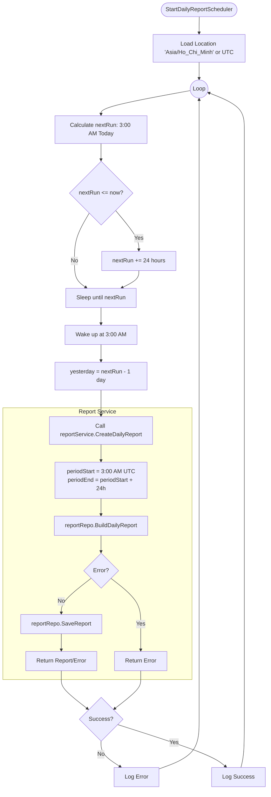

# Report Cronjob Flow

Biểu đồ mô tả luồng hoạt động của Report Scheduler (cronjob) được định nghĩa trong `internal/services/report_scheduler.go` và `internal/services/report.go`.

```mermaid
flowchart TD
    Start([StartDailyReportScheduler]) --> LoadLoc[Load Location 'Asia/Ho_Chi_Minh' or UTC]
    LoadLoc --> LoopStart((Loop))
    
    LoopStart --> CalcNextRun[Calculate nextRun: 3:00 AM Today]
    CalcNextRun --> CheckTime{nextRun <= now?}
    
    CheckTime -- Yes --> Add24h[nextRun += 24 hours]
    CheckTime -- No --> SleepRun
    Add24h --> SleepRun[Sleep until nextRun]
    
    SleepRun --> WakeUp[Wake up at 3:00 AM]
    WakeUp --> CalcYesterday[yesterday = nextRun - 1 day]
    
    CalcYesterday --> CallCreateDaily[Call reportService.CreateDailyReport]
    
    subgraph CreateDailyReport [Report Service]
        CallCreateDaily --> CalcPeriod[periodStart = 3:00 AM UTC<br/>periodEnd = periodStart + 24h]
        CalcPeriod --> BuildDaily[reportRepo.BuildDailyReport]
        BuildDaily --> CheckBuildErr{Error?}
        CheckBuildErr -- Yes --> ReturnErr[Return Error]
        CheckBuildErr -- No --> SaveDB[reportRepo.SaveReport]
        SaveDB --> ReturnResult[Return Report/Error]
    end
    
    ReturnResult --> CheckErr{Success?}
    ReturnErr --> CheckErr
    
    CheckErr -- No --> LogErr[Log Error]
    CheckErr -- Yes --> LogSuccess[Log Success]
    
    LogErr --> LoopStart
    LogSuccess --> LoopStart
```
